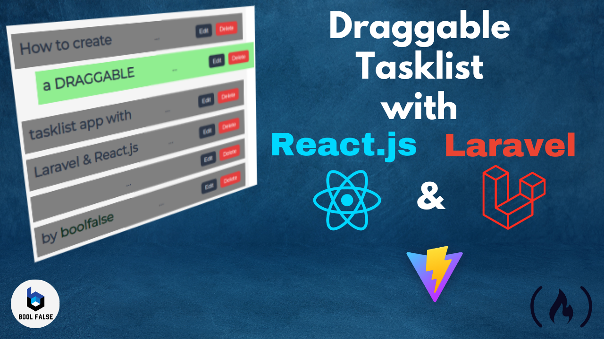

# Task list react laravel




## The Backend: How to Install Laravel

```bash
composer create-project laravel/laravel:^10.0 tasklist
cd tasklist
php artisan serve

```

```bash
php artisan make:model Project -m
php artisan make:model Task -m

```


## Formation 
[Freecodecamp](https://www.freecodecamp.org/news/use-react-with-laravel/#prerequisites)